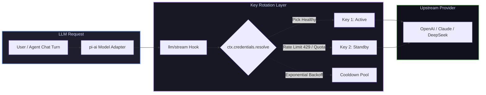

# 📦 @goodandready/dsh-key-rotation

<div align="center">

<h3>Hermes-Style Transparent API Key Pools & Rate Limit Failover for DeepSeek Harness</h3>

<p align="center">
  <a href="https://www.npmjs.com/package/@goodandready/dsh-key-rotation"></a>
  <a href="LICENSE"></a>
  <a href="https://github.com/topics/dsh-plugin"></a>
  <a href="https://nodejs.org"></a>
</p>

<p align="center">
  <a href="README.md"><b>🇬🇧 English</b></a> •
  <a href="README.ru.md"><b>🇷🇺 Русский</b></a> •
  <a href="README.zh.md"><b>🇨🇳 中文说明</b></a>
</p>

</div>

---

## ⚡ Overview

**`dsh-key-rotation`** provides transparent, per-provider API key rotation for **DeepSeek Harness**. Instead of failing queries on HTTP 429 quota exhaustion or concurrency limits, requests are instantly retried on the **next healthy key** in the pool.



---

## ✨ Key Features

* 🔄 **Transparent Provider Rotation**: Preserves the provider's exact identity and session state across multi-turn and tool-call turns while swapping API keys underneath.
* ⚡ **Instant 429 Failover**: Retries switchable errors (`QUOTA`, `RATE_LIMIT`, `AUTH`/`INVALID`) on the next healthy key before any streaming chunks are emitted.
* 📈 **Exponential Backoff**: Repeated failures double a key's cooldown (base → ×2 → ×4 → cap ×8), preventing dead keys from congesting the pool.
* 🖥️ **Full Settings GUI**: Dedicated **Settings → Key Rotation** panel with live key health status, cooldown timers, reordering buttons (↑/↓), and usage badges.
* 🛡️ **Zero Token/Secret Exposure**: Full key values stay in the host's Credentials store; browser clients only receive the last 5 characters for identification.
* 📥 **.env Batch Import**: Easily import `KEY=value` pairs directly from `.env` files into provider pools.

---

## 📦 Quick Installation

```bash
dsh plugin --profile web add @goodandready/dsh-key-rotation
```

---

## ⚙️ Configuration (`settings.yaml`)

```yaml
dsh-key-rotation:
  switchCodes: [QUOTA, RATE_LIMIT, SERVER, TIMEOUT, TRANSPORT, EMPTY_RESPONSE, UNKNOWN_MODEL]
  cooldownMs: 60000
  providers:
    - provider: openrouter
      keys: [OPENROUTER_API_KEY, OPENROUTER_API_KEY_2, OPENROUTER_API_KEY_3]
    - provider: deepseek
      keys: [DEEPSEEK_API_KEY, DEEPSEEK_API_KEY_BACKUP]
```

---

## 📄 License

MIT © [GooDAnDReaDY](https://github.com/GooDAnDReaDY)
