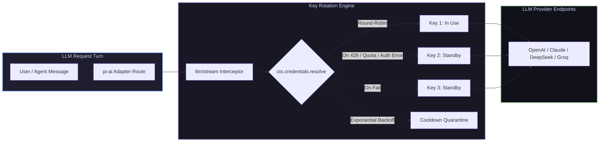

# 📦 @goodandready/dsh-key-rotation

<div align="center">

<h3>Hermes-Style Transparent API Key Pools & Rate Limit Failover for DeepSeek Harness</h3>

<p align="center">
  <a href="https://www.npmjs.com/package/@goodandready/dsh-key-rotation"></a>
  <a href="LICENSE"></a>
  <a href="https://github.com/topics/dsh-plugin"></a>
  <a href="https://nodejs.org"></a>
</p>

<p align="center">
  <a href="https://goodandready.app/"></a>
</p>

<p align="center">
  <a href="README.md"><b>🇬🇧 English</b></a> •
  <a href="README.ru.md"><b>🇷🇺 Русский</b></a> •
  <a href="README.zh.md"><b>🇨🇳 中文说明</b></a>
</p>

</div>

---

## ⚡ Overview

**`dsh-key-rotation`** provides transparent, Hermes-style **per-provider API key rotation** for [DeepSeek Harness](https://github.com/deepseek-ai/deepseek-harness) (dsh).

Instead of failing conversations on quota exhaustion or rate limits (HTTP 429), the plugin intercepts the request and instantly retries on the **next healthy key** in a per-provider pool before streaming chunks to the client.



---

## ✨ Full Feature Breakdown

### 🔄 Transparent Pool Architecture
* **Provider Identity Unchanged**: Rotation swaps only the underlying resolved API key, never the provider ID or route. Multi-call agent tool turns and replay states remain 100% consistent.
* **Instant Error Failover**: Intercepts switchable errors (`QUOTA`, `RATE_LIMIT`, `SERVER`, `TIMEOUT`, `TRANSPORT`, `EMPTY_RESPONSE`, `UNKNOWN_MODEL`, `AUTH`/`INVALID`) and retries on the next key before any token is emitted.
* **Smart Cooldown & Exponential Backoff**: Exhausted keys stay out of rotation for `cooldownMs`. Repeated failures on the same key double its cooldown (base → ×2 → ×4 → cap ×8), preventing dead keys from congesting the pool.
* **Dead / Revoked Key Handling**: Auth/invalid keys immediately rotate to the next key instead of throwing a fatal error to the user.
* **Non-Stream Safety Net**: An `agent/request-error` hook automatically protects non-streaming calls (Embeddings, Batch requests) with key failover.

---

### 🖥️ Rich Web GUI Features (**Settings → Key Rotation**)

| Feature | Description |
|---|---|
| **One-Click Key Creation** | Press *Add key*, paste value, done. System generates clean credential names (`<PROVIDER>_API_KEY`, `_2`, `_3`) shown on hover. |
| **Live Health Badges** | Real-time status for every key: `in use`, `ready`, `cooling down` (with live timer), and `no such credential` (catches typos). |
| **Key Reordering** | <kbd>↑</kbd> and <kbd>↓</kbd> buttons to adjust exact trial priority order. |
| **Switch Codes Checkboxes** | Intuitive visual toggles for switchable failure codes instead of raw string arrays. |
| **Reset Cooldown** | One-click *Reset cooldown* button to restore all keys immediately (`POST /dsh-key-rotation/reset`). |
| **Exhaustion Warning** | High-visibility warning alert when all keys for a provider are in cooldown. |
| **Failure Log Tracker** | Expandable *Recent failures* panel showing the last 20 events (`timestamp`, `key`, `reason`, `cooldownMs`). |
| **Fast Provider Search** | Live search box to filter provider cards by name or model ID. |
| **Bulk Cooldown Edit** | Select multiple providers and apply cooldown adjustments simultaneously. |
| **Undo Deletions** | 5-second *Undo* bar after removing a key or provider pool. |
| **Batch Import from `.env`** | File picker parses `KEY=value` pairs directly into provider pools. |
| **Sort by Usage** | <kbd>⇅</kbd> Sorts keys dynamically by total lifetime requests (descending). |
| **Last Used Indicators** | Shows "N minutes ago" badge next to each active key. |

---

## 🔒 Security & Credential Storage

* **Zero Plaintext Storage in Config**: The plugin configuration only ever references key **names** (e.g. `MY_PROVIDER_API_KEY`).
* **Protected Host Storage**: Actual secret values reside in `$DSH_HOME/.credentials.yaml` and the DSH `Credentials` service.
* **5-Character Browser Masking**: Key values are never transmitted back to the browser; the Web UI only receives the **last 5 characters** to distinguish keys visually.
* **Loopback Fencing**: Management routes (`GET /dsh-key-rotation/status`, `PUT|DELETE /dsh-key-rotation/key`, `POST /dsh-key-rotation/reset`) reject all non-loopback same-origin requests.

---

## 📦 Quick Installation

```bash
# From npm:
dsh plugin --profile web add @goodandready/dsh-key-rotation

# From GitHub:
dsh plugin --profile web add github:GooDAnDReaDY/dsh-key-rotation
```

> [!IMPORTANT]
> Restart DSH Web UI after installation (`systemctl --user restart dsh-web`) and reload the browser tab.

---

## ⚙️ Configuration (`settings.yaml`)

```yaml
dsh-key-rotation:
  switchCodes: [QUOTA, RATE_LIMIT, SERVER, TIMEOUT, TRANSPORT, EMPTY_RESPONSE, UNKNOWN_MODEL]
  cooldownMs: 60000
  providers:
    - provider: openrouter
      keys: [OPENROUTER_API_KEY, OPENROUTER_API_KEY_2, OPENROUTER_API_KEY_3]
    - provider: deepseek
      keys: [DEEPSEEK_API_KEY, DEEPSEEK_API_KEY_BACKUP]
    - provider: anthropic
      keys: [ANTHROPIC_API_KEY, ANTHROPIC_API_KEY_2]
```

### Parameter Reference

| Parameter | Default | Description |
|---|---|---|
| `switchCodes` | `[QUOTA, RATE_LIMIT, SERVER, TIMEOUT, TRANSPORT, EMPTY_RESPONSE, UNKNOWN_MODEL]` | Error codes that immediately trigger failover to the next key. |
| `cooldownMs` | `60000` (1 min) | Base duration (in ms) an exhausted key remains quarantined. |
| `providers` | `[]` | List of `{ provider, keys: [envName, ...] }` key pools per model provider. |

---

## 📄 License

MIT © [GooDAnDReaDY](https://github.com/GooDAnDReaDY)
