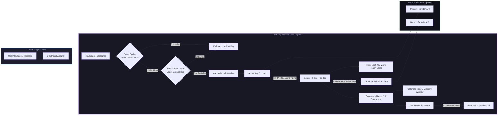

# 📦 @goodandready/dsh-key-rotation

<div align="center">

<h3>Enterprise-Grade Transparent API Key Rotation, Rate-Limit Pre-emption & Failover Cascade for DeepSeek Harness</h3>

<p align="center">
  <a href="https://www.npmjs.com/package/@goodandready/dsh-key-rotation"></a>
  <a href="LICENSE"></a>
  <a href="https://github.com/topics/dsh-plugin"></a>
  <a href="https://nodejs.org"></a>
</p>

<!-- Showcase Link -->
<p align="center">
  <a href="https://goodandready.app/"></a>
</p>

<p align="center">
  <a href="README.md"><b>🇬🇧 English</b></a> •
  <a href="README.ru.md"><b>🇷🇺 Русский</b></a> •
  <a href="README.zh.md"><b>🇨🇳 中文说明</b></a>
</p>

</div>

---

## ⚡ Overview & The Problem

### 🛠️ What's New in v0.8.0 (Stability)
- **🔌 Circuit breaker**: after N consecutive provider failures the circuit opens and requests fail fast (`CIRCUIT_OPEN`) until a cool-down; half-open probes recover automatically.
- **🕒 Monotonic clock**: cooldown/breaker durations use process monotonic time so NTP steps cannot invert remaining times.
- **📮 Non-blocking webhooks**: alerts go through a bounded queue with backoff — stream rotation never waits on webhook HTTP.
- **🧱 Atomic I/O helpers**: crash-safe writes; corrupt JSON never overwrites previous in-memory state.
- **🧹 Clone-route GC**: orphaned auto-created clone routes are dropped from the runtime set.
- **🧭 Error taxonomy**: explicit switch/surface/soft classification for 408/425/429/5xx, sockets and gRPC codes.
- **📡 Status extras**: per-provider `circuit` plus `meta.expectedClones` / `meta.notifyQueue`.
- **🧪 Smoke harness**: scripted 429 → next-key → success path in `test/smoke-rotation-080.test.mjs`.


### 🛠️ What's New in v0.7.33 (Stability & Bugfix Release)
- **🔍 Resolved Key Probing BaseURL**: Fixed `resolveBaseUrl` to map key credential refs to owning provider pools, restoring live `probeModels` testing.
- **🛡️ Guarded Cascade Recursion**: Prevented call stack overflow in cross-provider failover when circular cascade chains occur.
- **🕒 Accurate Midnight PST Resets**: Corrected UTC-8 timezone calculation offset sign for calendar quota reset windows.
- **🧹 Lifecycle Timer Cleanup**: Wrapped `canaryTimer` and `selfHealTimer` in Cordis effect scopes, eliminating background orphaned intervals on hot reload.
- **⚡ Stale Lock Recovery in Load Balancer**: Added expired lock detection to `pickLeastLoaded` for uninterrupted least-connections routing.
- **🎨 Native Design System (Changed in v0.8.3)**: Unified with `dsh-clinebot` baseline: modular section cards, live pool telemetry stat boxes, pill badges, and complete semantic theme token styling (#281).
- **🌐 Localization (Changed in v0.8.2)**: Source strings are English-only. Russian/Chinese UI comes from the DSH core locale service and translation plugins (`props.t`). Active locale: host snapshot → first `navigator.languages` entry → `en` (#277).


### 🚀 What's New in v0.7.31
- **⚡ O(1) TokenBucket Accumulator**: Upgraded rate limiting math to O(1) time and zero-allocation memory with adaptive header synchronization.
- **🛡️ Soft vs Hard Backoff**: Differentiates transient infrastructure drops (502/503/timeouts: 10s flat cooldown) from hard quota errors (progressive doubling).
- **⏳ Penalty Decay**: Stable keys that operate cleanly automatically decay their failure penalty multiplier every hour.
- **🎲 Cooldown Jitter**: Adds ±12.5% random dispersion to recovery timers, eliminating thundering herd stampedes.
- **🎯 Addressable Canary Probing**: Support for probing target pool models with lightweight single-token verification pings.
- **📊 TTFT Percentiles (p50 / p95 / p99)**: Sub-second high-resolution latency percentile tracking across all key pools.
- **🔔 Webhook Alert Digest**: Aggregates multiple rapid switch/cooldown events into consolidated incident digests for Telegram, Discord, and Slack.
- **🧹 30-Day Usage Compaction**: Automatic bounded memory management with 30-day rolling window data pruning.
- **✨ Optimistic UI & Filter Pills**: Instant zero-latency UI updates on reset, plus `All`, `Ready`, `In Cooldown`, and `With Errors` quick filter chips.


High-throughput autonomous agent workflows, parallel subagent swarms, and multi-turn tool loops inevitably hit upstream API rate limits (HTTP 429, RPM/TPM exhaustion, daily quotas, or sudden provider outages). In standard DeepSeek Harness deployments, a single exhausted API key breaks the entire agent execution chain, requiring manual intervention and destroying the session's replay state.

**`dsh-key-rotation`** provides a seamless, enterprise-ready **transparent API key pooling, pre-emptive rate-limiting, and cross-provider failover engine** built natively on the Cordis microkernel architecture.

Unlike naive routing proxies that alter provider identifiers, `dsh-key-rotation` hooks into `ctx.credentials.resolve` and intercepts `llm/stream` at runtime:
* **The provider identity never changes**: Agent replay states, multi-call turns, and tool schemas remain 100% consistent.
* **Pre-emptive Token Bucket**: Throttled keys are skipped *before* issuing network calls, eliminating retry latency.
* **Least-Connections Concurrency Control**: Balances in-flight streams across keys to prevent burst saturation.
* **Autonomous Self-Healing & Cascades**: Lifts expired quarantines on idle keys and smoothly escalates to fallback providers if an entire pool is exhausted.

---

## 🏗️ Architecture & Request Lifecycle



---

## ✨ Full Feature Breakdown

### 🔄 1. Transparent Rotation & Failover
* **Unchanged Provider Identity**: Rotates only the underlying resolved API credential ref, never the provider ID. Prevents `INVALID_REPLAY_STATE` crashes in `pi-ai` multi-turn sessions.
* **Zero-Token-Loss Stream Retries**: If an API key encounters an error before the first content chunk is emitted, the request is transparently re-dispatched to the next healthy key in the pool.
* **Comprehensive Switch Codes**: Automatically fails over on `QUOTA`, `RATE_LIMIT`, `SERVER`, `TIMEOUT`, `TRANSPORT`, `EMPTY_RESPONSE`, `UNKNOWN_MODEL`, `AUTH`, and `INVALID` error codes.
* **Intelligent Message Pattern Matching**: Fallback regex classifier (`SWITCHABLE_MESSAGE_PATTERN`) identifies text-based quota/rate-limit errors thrown as generic exceptions by upstream SDKs.
* **Non-Streaming Safety Net**: Synchronous calls (e.g., embeddings, batch evaluations) are protected via the `agent/request-error` lifecycle hook.

### ⏱️ 2. Rate-Limit Pre-emption & Concurrency Control
* **Token Bucket / Leaky Bucket (`lib/bucket.js`)**: Sliding-window tracking of Requests Per Minute (`rpmLimit`) and Tokens Per Minute (`tpmLimit`). Quarantines saturated keys *before* dispatching network requests, preventing 429 roundtrips.
* **Least-Connections Balancer (`lib/concurrency.js`)**: Tracks active in-flight streams per key (`inFlight`). Distributes concurrent requests evenly across available credentials and enforces `maxConcurrency` limits.
* **Stale Lock Auto-Release**: Deadlocks from disconnected clients or aborted network sockets are automatically purged after 5 minutes.

### 🛡️ 3. Autonomous Healing & Cascade Escalation
* **Cross-Provider Failover Cascade (`lib/cascade.js`)**: If all keys for a selected provider are in cooldown, requests automatically cascade to an alternative fallback provider pool (e.g., primary provider → fallback proxy / secondary provider).
* **Sandbox Key Probes (`lib/sandbox.js`)**: On-demand `/models` probes validate a key before returning it to rotation; idle cooldowns are lifted by the self-heal sweep.
* **Calendar & Rolling Quota Reset Windows (`lib/quota-window.js`)**: Supports scheduled quota reset alignments (`midnight_utc`, `midnight_pst`, and `rolling_24h`) so daily free/tier quotas unfreeze exactly when upstream resets them.
* **Adaptive Exponential Backoff (`lib/pool.js`)**: Successive failures on a key double its quarantine duration (base → ×2 → ×4 → cap ×8). Successful requests gradually restore healthy status.

### 🎯 4. Model-Aware Routing
* **Model Sub-Pools (`lib/pool.js`)**: Configure dedicated key pools for specific model tiers (e.g. reasoning/heavy models vs fast/cheap utility models).
* **Tag-Based Routing**: Assign operational tags (`production`, `background`, `eval`) to match key usage with workload priorities.

### 📊 5. Observability, Telemetry & Webhooks
* **Interactive Multi-Platform Webhooks (`lib/webhook.js`)**: Dispatches rich notifications with HMAC-signed action buttons for **Telegram** (Inline Keyboards), **Discord** (Action Rows), and **Slack** (Block Kit). Administrators can click buttons to reset cooldowns or pause providers directly from their mobile chat.
* **Usage & Cost Reporting (`lib/usage-report.js`)**: Per-key daily request counters and estimated cost breakdown with one-click CSV/JSON export (`GET /dsh-key-rotation/usage-report`).
* **Latency SLO & Histogram (`lib/histogram.js`)**: Tracks Time-To-First-Token (TTFT) and stream durations with health score degradation scoring (`0..100`).

---

## 🖥️ Rich Web GUI & Dashboard

Access full visual management under **Settings → Key Rotation** or via the Header quick-widget.

| Interface Feature | Description |
|---|---|
| **Header Status Widget** | Compact live badge in DSH header: 🟢 `All Healthy` \| 🟡 `Cooldown Active` \| 🔴 `Pool Exhausted` with quick popover actions. |
| **1-Click Health Matrix** | "Health Matrix" dashboard running parallel sandbox probes across all providers, keys, and models with TTFT latency and status badges. |
| **Instant Key Provisioning** | Add keys with auto-generated names (`<PROVIDER>_API_KEY`, `_2`, `_3`) and automatic key-tail disambiguation. |
| **Live Status Badges** | Visual states: `In Use`, `Ready`, `Cooling Down` (with live countdown timer), and `Not Found`. |
| **Drag & Priority Ordering** | Reorder keys with <kbd>↑</kbd> and <kbd>↓</kbd> buttons to fine-tune selection precedence. |
| **Switch Code Toggles** | Interactive checkboxes for switchable error conditions. |
| **Secret Leak Detector** | Real-time input sanitizer (`lib/keycheck.js`) catching accidental pastes of private keys, SSH keys, or misplaced tokens. |
| **Batch `.env` Import** | Parse standard `.env` key-value pairs directly into corresponding provider pools. |
| **5-Second Undo Bar** | Non-destructive undo bar for accidental key or pool removals. |
| **Usage Analytics Chart** | Interactive breakdown of lifetime requests and daily trends per key. |

---

## 🔒 Security & Safe Storage

* **Zero Plaintext Secrets in Plugin Config**: Configuration files store only environment variable reference names (e.g. `MY_PROVIDER_API_KEY`).
* **Secure Vault Storage**: Actual secret values reside securely in `$DSH_HOME/.credentials.yaml` managed by the DSH `Credentials` service.
* **5-Character Masking (`keyTail`)**: Full secret values are never sent to the client browser; only the trailing 5 characters are exposed for visual identification.
* **Loopback & Same-Origin Fencing**: Administrative endpoints (`GET /status`, `PUT /key`, `POST /reset`, `POST /test-matrix`) strictly enforce loopback origin checks (`isTrustedBridgeRequest`).

---

## 📦 Installation

```bash
# Install via DSH Plugin Manager (Web Profile):
dsh plugin --profile web add @goodandready/dsh-key-rotation

# Or directly from GitHub:
dsh plugin --profile web add github:GooDAnDReaDY/dsh-key-rotation
```

> [!IMPORTANT]
> Restart DeepSeek Harness web service after installation and refresh your browser tab:
> ```bash
> systemctl --user restart dsh-web
> ```

---

## ⚙️ Configuration Reference (`settings.yaml`)

```yaml
dsh-key-rotation:
  switchCodes:
    - QUOTA
    - RATE_LIMIT
    - SERVER
    - TIMEOUT
    - TRANSPORT
    - EMPTY_RESPONSE
    - UNKNOWN_MODEL
    - AUTH
  cooldownMs: 60000
  # v0.8.0 circuit breaker
  circuitBreakerEnabled: true
  circuitBreakerThreshold: 5
  circuitBreakerOpenMs: 30000
  circuitBreakerHalfOpenProbes: 1
  concurrencyLimit: 5
  quotaResetWindow:
    type: midnight_utc
    hour: 0
  cascade:
    - provider: backup-provider-id
      model: your-backup-model-id
  webhookUrl: "https://api.telegram.org/bot<TOKEN>/sendMessage?chat_id=<CHAT_ID>"
  providers:
    - provider: your-primary-provider
      rpmLimit: 60
      tpmLimit: 100000
      keys:
        - PRIMARY_API_KEY
        - PRIMARY_API_KEY_2
        - PRIMARY_API_KEY_BACKUP
    - provider: secondary-provider
      keys:
        - SECONDARY_API_KEY
        - SECONDARY_API_KEY_2
```

### Parameter Reference

| Parameter | Type | Default | Description |
|---|---|---|---|
| `switchCodes` | `string[]` | `[QUOTA, RATE_LIMIT, ...]` | List of error codes that immediately trigger failover. |
| `cooldownMs` | `number` | `60000` (1 min) | Base penalty duration (in ms) for quarantined keys. |
| `circuitBreakerEnabled` | `boolean` | `true` | Enable per-provider circuit breaker (v0.8.0). |
| `circuitBreakerThreshold` | `number` | `5` | Consecutive failures before opening the circuit. |
| `circuitBreakerOpenMs` | `number` | `30000` | How long the circuit stays open (ms). |
| `circuitBreakerHalfOpenProbes` | `number` | `1` | Probe requests allowed in half-open state. |
| `verboseLogging` | `boolean` | `false` | Per-request rotation logs (noisy; off by default). |
| `concurrencyLimit` | `number` | `0` (disabled) | Max concurrent in-flight streams per key (0 = unlimited). |
| `quotaResetWindow` | `object` | `null` | Calendar reset alignment (`midnight_utc`, `midnight_pst`, `rolling_24h`). |
| `cascade` | `array` | `[]` | Fallback provider chain when primary pool is completely exhausted. |
| `webhookUrl` | `string` | `""` | Target URL for interactive Telegram, Discord, Slack, or generic alerts. |
| `providers` | `array` | `[]` | List of `{ provider, keys, rpmLimit, tpmLimit, modelPools }` definitions. |

---

## 🔌 HTTP Bridge API Reference

All management routes require loopback authentication (`127.0.0.1` / `::1`) with same-origin validation:

| Route | Method | Description |
|---|---|---|
| `/dsh-key-rotation/status` | `GET` | Real-time health, keys, cooldowns. Since v0.8.0 also `providers[].circuit` and `meta` (`expectedClones`, `notifyQueue`). |
| `/dsh-key-rotation/config` | `GET` / `PUT` | Read and update active key rotation settings and provider pools. |
| `/dsh-key-rotation/key` | `PUT` / `DELETE` | Add, update, or remove credentials in host storage and pool. |
| `/dsh-key-rotation/reset` | `POST` | Instantly resets all cooldowns and restores all keys to `ready`. |
| `/dsh-key-rotation/test-matrix` | `POST` | Triggers parallel health check across all configured keys and models. |
| `/dsh-key-rotation/usage-report` | `GET` | Returns aggregated usage metrics in JSON or CSV format (`?format=csv`). |
| `/dsh-key-rotation/webhook-callback`| `POST` | Receives and executes interactive actions from Telegram/Slack callbacks. |

---

## 📄 License

MIT © [GooDAnDReaDY](https://github.com/GooDAnDReaDY)

### v0.7.39
- **Self-Healing & lastUsedAt Accuracy**: Fixed key timestamp lookup in `healIdleCooldowns` to read from the modern `pool.state.lastUsedAt` map (with backwards-compatible fallback). `credentials.resolve` now properly records each key invocation timestamp in `lastUsedAt`, surfacing accurate "last used" indicators in the status dashboard and enabling background idle cooldown restoration.
- **Hotpath & Runtime Memoization**: Eliminated redundant `buildRuntime()` calls across periodic sweeps, provider exhaustion handling, and `/status` query processing.
- **Test Suite & CI Hardening**: Periodic interval sweep timers and debounce timers unref'ed to allow Node.js event loop natural exit without stalling CI runners. Purged obsolete incident test artifacts.

### v0.7.38
- **Hot-Path Stream Optimization**: Eliminated 4 redundant `buildRuntime()` calls inside the `rotate()` finish chunk handler by reusing the request-scoped `runtime0` snapshot.
- **Allocation-Free Rate Limit Header Parsing**: Optimized `extractRateLimit()` with single-pass header inspection and length guards, completely removing dynamic lowercase/uppercase string allocations on every response chunk.
- **Date ISO String Memoization**: Memoized `todayIso` string calculation once per finishing request instead of creating multiple `Date` instances for `costDays` and `usageDays`.
- **Zero-Allocation Metrics Aggregation**: Replaced intermediate array allocation `[...values()].reduce()` with iterative summation for `totalUsage` in the `/dsh-key-rotation/status` endpoint.
- **Stale Notification Cleanup**: Automatically purge stale entries in notification throttling maps (`budgetNotifiedAt`, `lowHealthNotifiedAt`) when provider pools are deleted.

### v0.7.37
- **Request Context Isolation via AsyncLocalStorage**: Scoped active key resolution (`pickedRef`), start timestamps, and retry counts strictly to each async dispatch context using Node's `node:async_hooks`. Eliminates race conditions where concurrent streaming requests could penalize healthy keys.
- **Failover on Pre-Yield Stream Exceptions**: Fixed fatal stream termination where transport errors (e.g. HTTP 429 thrown before headers, socket hang-up) aborted the generator. The catch block now inspects `isSwitchableError` and cascades seamlessly to the next key if no content tokens have been yielded.
- **Pure Local Candidate List in rotate()**: Generator uses an isolated local slice of keys (`attemptList`), eliminating shared mutations on `pool.weightedRefs`.
- **Automatic Quarantine Release on Probe Success**: Successful sandbox model tests via Settings UI (`/dsh-key-rotation/test`) automatically lift `failedUntil` and `brokenUntil` quarantine flags.
- **Long-Term Memory Compaction**: Wired `compactUsage(pool, 30, now)` into the periodic 30-second maintenance sweep to prevent memory growth on high-uptime servers.
- **Request-Scoped Latency Recording**: Replaced module-global start timestamp with context-scoped `startMs` for accurate p50/p95 latency metrics under concurrent load.

### v0.7.36
- **Architecture de-bloat & hardening**: Removed 6 unused/overengineered modules (`shadow`, `incident`, `agent-budget`, `region`, `canary`, `maintenance`) and dead route registrations.
- **High-throughput buildRuntime memoization**: Eliminates per-token deep-cloning and schema validation on every streaming chunk.
- **Atomic round-robin pointer rotation**: Concurrent requests advance pointer immediately on candidate selection, eliminating race conditions on simultaneous tool calls.
- **Enhanced switchable error detection**: Direct parsing of HTTP status codes (`429`, `401`, `403`, `5xx`) and gRPC codes (`RESOURCE_EXHAUSTED`, `UNAVAILABLE`) alongside regex fallback.
- **Informative user exhaustion messaging**: Clear countdown notice with next key recovery ETA when all keys in a pool are cooling down.
- **Smart polling**: Client background polling paused when browser tab is inactive (`document.visibilityState`).

### v0.7.35
- **Lifecycle Cleanups**: Wrapped `credentials.resolve` patch and `ctx.on` event handlers (`llm/stream`, `agent/request-error`) in `ctx.effect` scopes with guaranteed unmount cleanup (#238, #239).
- **Settings & Secret Roles**: Added `.role('secret')` to `incidentGitHubToken` and `webhookActionToken` in `Config` schema for automatic UI masking (#237).
- **Settings Architecture & UI**: Added native `settingsScope` snapshot reading/saving in settings card with graceful bridge fallback (#235).
- **Localization (Changed in v0.8.2)**: Card uses `props.t` with `locale: NS`; plugin registers only `en`; no `settings.section` fallback and no bundled `ru`/`zh` tables (#236, #275, #277).
- **Dead Code Purge**: Removed obsolete `mountDashboard` routine after header-chip migration (#240).
