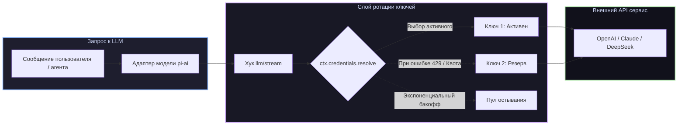

# 📦 @goodandready/dsh-key-rotation

<div align="center">

<h3>Прозрачная ротация API-ключей и мгновенное переключение при лимитах 429 для DeepSeek Harness</h3>

<p align="center">
  <a href="https://www.npmjs.com/package/@goodandready/dsh-key-rotation"></a>
  <a href="LICENSE"></a>
  <a href="https://github.com/topics/dsh-plugin"></a>
  <a href="https://nodejs.org"></a>
</p>

<p align="center">
  <a href="README.md"><b>🇬🇧 English</b></a> •
  <a href="README.ru.md"><b>🇷🇺 Русский</b></a> •
  <a href="README.zh.md"><b>🇨🇳 中文说明</b></a>
</p>

</div>

---

## ⚡ Обзор

**`dsh-key-rotation`** обеспечивает прозрачную ротацию пулов API-ключей для каждого провайдера в **DeepSeek Harness**. При исчерпании лимитов или ошибках rate-limit (HTTP 429) запрос мгновенно и незаметно для пользователя повторяется со **следующим работоспособным ключом**.



---

## ✨ Ключевые возможности

* 🔄 **Прозрачная ротация**: сохраняет идентичность провайдера и состояние сессии при смене ключей.
* ⚡ **Мгновенная отработка 429**: перехватывает ошибки `QUOTA`, `RATE_LIMIT`, `AUTH` до отправки первого чанка клиенту.
* 📈 **Экспоненциальный бэкофф**: повторные сбои удваивают время кулдауна ключа (базовый → ×2 → ×4 → макс ×8).
* 🖥️ **Панель управления (Web GUI)**: раздел **Настройки → Ротация ключей** с живым статусом, таймерами остывания и сортировкой ↑/↓.
* 🛡️ **Безопасность секретов**: значения ключей не покидают хранилище Credentials (браузер видит только последние 5 символов).
* 📥 **Импорт из `.env`**: быстрое добавление ключей списком из файлов окружения.

---

## 📦 Быстрая установка

```bash
dsh plugin --profile web add @goodandready/dsh-key-rotation
```

---

## 📄 Лицензия

MIT © [GooDAnDReaDY](https://github.com/GooDAnDReaDY)
