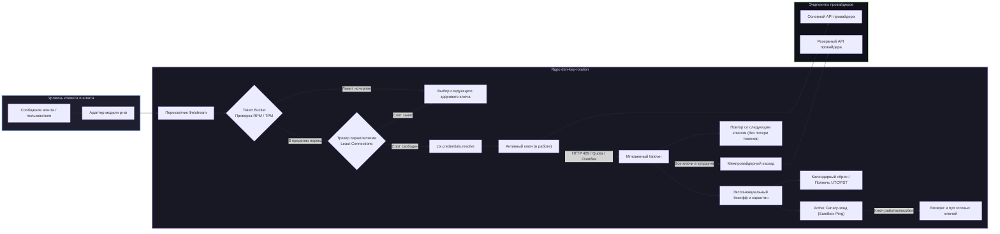

# 📦 @goodandready/dsh-key-rotation

<div align="center">

<h3>Прозрачная ротация API-ключей, предиктивный контроль лимитов и межпровайдерный каскадный failover для DeepSeek Harness</h3>

<p align="center">
  <a href="https://www.npmjs.com/package/@goodandready/dsh-key-rotation"></a>
  <a href="LICENSE"></a>
  <a href="https://github.com/topics/dsh-plugin"></a>
  <a href="https://nodejs.org"></a>
</p>

<!-- Обязательная кнопка перехода на витрину всех проектов -->
<p align="center">
  <a href="https://goodandready.app/"></a>
</p>

<p align="center">
  <a href="README.md"><b>🇬🇧 English</b></a> •
  <a href="README.ru.md"><b>🇷🇺 Русский</b></a> •
  <a href="README.zh.md"><b>🇨🇳 中文说明</b></a>
</p>

</div>

---

## ⚡ Обзор и решаемая проблема

### 🛠️ Что нового в версии 0.7.33 (Хотфикс и повышение стабильности)
- **🔍 Исправление проверки ключей**: Функция `resolveBaseUrl` теперь сопоставляет ref ключа с его пулом, восстанавливая работу живого тестирования моделей.
- **🛡️ Защита от зацикливания каскада**: Устранена возможность переполнения стека при взаимных кольцевых цепочках failover.
- **🕒 Точный сброс квот по PST**: Исправлен знак часового смещения UTC-8 для корректного сброса лимитов в полночь по тихоокеанскому времени.
- **🧹 Очистка таймеров в жизненном цикле**: Таймеры `canaryTimer` и `selfHealTimer` переведены на эффекты Cordis, исключая утечки при горячей перезагрузке.
- **⚡ Сброс зависших блокировок**: Алгоритм `pickLeastLoaded` теперь учитывает протухшие блокировки при выборе наименее нагруженного ключа.
- **🌐 Полная китайская локализация**: Добавлен словарь `zh` в веб-интерфейс настроек для соблюдения стандарта трёх языков (EN/RU/ZH).


### 🚀 Что нового в версии 0.7.31
- **⚡ $O(1)$ Накопитель TokenBucket**: Оптимизация математики лимитов до $O(1)$ по времени и без аллокаций памяти с адаптивной синхронизацией по заголовкам.
- **🛡️ Разделение Soft / Hard сбоев**: Кратковременные сетевые сбои (502/503/таймауты) получают короткий 10-секундный кулдаун без штрафного удвоения.
- **⏳ Затухание штрафов (Penalty Decay)**: Стабильно работающие ключи автоматически снижают штрафной множитель 1 раз в час.
- **🎲 Джиттер кулдауна**: Случайный разброс $\pm 12.5\%$ времени разблокировки предотвращает наплыв запросов на апстрим.
- **🎯 Адресное зондирование модели**: Опция целевого микро-пробинга моделей в Canary Prober.
- **📊 Перцентили задержки TTFT (p50 / p95 / p99)**: Расчет высокоточных перцентилей задержки первого токена в метриках здоровья.
- **🔔 Дайджест вебхук-алертов**: Группировка серии быстрых сбоев за 5-секундное окно в единый сводный отчет для Telegram, Discord и Slack.
- **🧹 30-дневная компактизация**: Автоматическая очистка истории старше 30 дней для защиты от утечек памяти.
- **✨ Оптимистичный UI и фильтры**: Мгновенный отклик кнопок сброса и статус-пилюли (`Все`, `Готовы`, `В кулдауне`, `С ошибками`) над списком ключей.


При активной работе автономных агентов, параллельном запуске субагентов и циклических вызовах инструментов запросы неизбежно упираются в ограничения провайдеров (ошибки HTTP 429 Too Many Requests, исчерпание суточных квот или временные сбои на стороне апстрима). В стандартной конфигурации DeepSeek Harness исчерпание одного API-ключа полностью блокирует цепочку рассуждений агента, ломает сохранённое состояние диалога (Replay State) и требует ручного вмешательства администратора.

**`dsh-key-rotation`** реализует отказоустойчивую корпоративную архитектуру **пулов API-ключей с предиктивным контролем лимитов (Token Bucket) и каскадным переключением на резервных провайдеров**, нативно интегрированную в микроядро Cordis.

В отличие от внешних прокси-маршрутизаторов, подменяющих идентификаторы моделей, `dsh-key-rotation` работает на уровне перехвата `ctx.credentials.resolve` и хука `llm/stream`:
* **Идентичность провайдера остаётся неизменной**: Внутреннее Replay-состояние агента `pi-ai` и контекст инструментов остаются на 100% консистентными.
* **Предиктивный Token Bucket**: Перегруженные ключи пропускаются **до** выполнения сетевого запроса, устраняя задержку на сетевой ретрай.
* **Балансировка Least-Connections**: Запросы равномерно распределяются по свободным ключам с контролем параллелизма (`maxConcurrency`).
* **Автономное самовосстановление и каскад**: Фоновые canary-зонды проверяют заблокированные ключи, а при полном исчерпании пула запрос бесшовно передаётся запасному провайдеру.

---

## 🏗️ Архитектура и жизненный цикл запроса



---

## ✨ Исчерпывающий разбор возможностей

### 🔄 1. Прозрачная ротация и мгновенный Failover
* **Сохранение сессии агента**: Ротация подменяет только физический API-токен, оставляя неизменным ID провайдера. Исключает падения `INVALID_REPLAY_STATE` в мульти-инструментальных сценариях.
* **Бесшовный повтор до отдачи чанков**: Если ключ падает с ошибкой до начала генерации первого токена, запрос прозрачно перенаправляется на следующий доступный ключ.
* **Полный спектр кодов переключения**: Авто-переключение при ошибках `QUOTA`, `RATE_LIMIT`, `SERVER`, `TIMEOUT`, `TRANSPORT`, `EMPTY_RESPONSE`, `UNKNOWN_MODEL`, `AUTH` и `INVALID`.
* **Интеллектуальный парсер текста ошибок**: Регулярные выражения (`SWITCHABLE_MESSAGE_PATTERN`) распознают текстовые сообщения об исчерпании лимитов, которые SDK провайдеров выбрасывают как неструктурированные исключения.
* **Защита нестриминговых вызовов**: Синхронные операции (эмбеддинги, батч-оценки) защищены хуком `agent/request-error`.

### ⏱️ 2. Предиктивный Token Bucket и контроль параллелизма
* **Token Bucket / Leaky Bucket (`lib/bucket.js`)**: Скользящее минутное окно отслеживания запросов (`rpmLimit`) и токенов (`tpmLimit`). Блокирует исчерпанный ключ **до** отправки запроса в сеть, исключая потерю времени на сетевой 429.
* **Балансировщик Least-Connections (`lib/concurrency.js`)**: Отслеживает активные in-flight соединения на каждом ключе (`inFlight`). Равномерно распределяет параллельную нагрузку и соблюдает лимит `maxConcurrency`.
* **Авто-очистка зависших блокировок**: При аварийном разрыве сетевых соединений счетчики соединений автоматически очищаются через 5 минут.

### 🛡️ 3. Автономное самовосстановление и каскадный Failover
* **Межпровайдерный каскад (`lib/cascade.js`)**: При исчерпании всех ключей выбранного провайдера запрос автоматически каскадируется на настроенного резервного провайдера (`cascade: [{ provider, model }]`).
* **Active Canary Prober (`lib/canary.js`)**: Перед выводом ключа из кулдауна плагин выполняет легкий фоновый зонд (`/models` probe через `SandboxRunner`), защищая боевой трафик от повторных сбоев.
* **Календарный сброс квот (`lib/quota-window.js`)**: Учитывает окна сброса суточных квот провайдеров (`midnight_utc`, `midnight_pst`, `rolling_24h`), снимая карантин ровно в момент обновления лимитов у апстрима.
* **Экспоненциальный бэкофф (`lib/pool.js`)**: Повторные сбои на ключе прогрессивно увеличивают время кулдауна (базовое → ×2 → ×4 → максимум ×8).

### 🎯 4. Маршрутизация по моделям и гео-регионам
* **Модельные подпулы (`lib/pool.js`)**: Назначение выделенных ключей под конкретные модели (например, отдельные ключи для тяжелых reasoning-моделей и дешевые ключи для утилит).
* **Тегирование ключей**: Метки приоритета (`production`, `background`, `eval`) для разделения квот между интерактивными и фоновыми задачами.
* **Гео-роутинг (`lib/region.js`)**: Маршрутизация запросов через оптимальные региональные эндпоинты.

### 📊 5. Телеметрия, аналитика и интерактивные вебхуки
* **Интерактивные вебхуки (`lib/webhook.js`)**: Отправка форматированных алертов с кнопками действий в **Telegram** (Inline Keyboards), **Discord** (Action Rows) и **Slack** (Block Kit). Администратор может сбросить кулдаун или отключить провайдер прямо из мессенджера.
* **Отчеты об использовании и расходах (`lib/usage-report.js`)**: Учет суточного числа запросов и расчетной стоимости по каждому ключу с экспортом в CSV/JSON (`GET /dsh-key-rotation/usage-report`).
* **Гистограмма задержек SLO (`lib/histogram.js`)**: Измерение времени до первого токена (TTFT) и расчет индекса здоровья пула (`0..100`).
* **Автоматические инциденты (`lib/incident.js`)**: Создание issue в GitHub при масштабных системных сбоях провайдеров.
* **Shadow-трафик (`lib/shadow.js`)**: Теневое дублирование процента запросов для тестирования альтернативных провайдеров.

---

## 🖥️ Панель управления в Web GUI

Управление доступно в разделе **Настройки → Ротация ключей** или через быстрый виджет в шапке.

| Элемент интерфейса | Описание |
|---|---|
| **Виджет в шапке / статусбаре** | Компактный статус: 🟢 `Все в норме` \| 🟡 `Есть ключи в кулдауне` \| 🔴 `Пул исчерпан` с быстрым всплывающим меню. |
| **Матрица здоровья (1-Click Matrix)** | Интерактивная таблица "Health Matrix" с параллельным зондированием всех ключей, моделей и отображением задержки TTFT. |
| **Быстрое добавление ключей** | Добавление ключа в 1 клик с автогенерацией имени (`<PROVIDER>_API_KEY`, `_2`, `_3`) и маскировкой. |
| **Живые бейджи статуса** | Индикаторы: `Используется`, `Готов`, `Остывает` (с живым таймером обратного отсчета) и `Не найден`. |
| **Приоритет ключей** | Кнопки <kbd>↑</kbd> и <kbd>↓</kbd> для настройки точного порядка перебора в пуле. |
| **Чекбоксы кодов ошибок** | Наглядные переключатели условий срабатывания ротации. |
| **Детектор утечек секретов** | Валидация форматов токенов (`lib/keycheck.js`) и защита от случайной вставки приватных SSH/RSA-ключей. |
| **Импорт из `.env`** | Массовая загрузка пар `KEY=value` из файлов конфигурации. |
| **Отмена действий (5 сек)** | Всплывающая плашка отмены при случайном удалении ключа или пула. |
| **График активности** | Наглядная статистика запросов и динамики использования ключей. |

---

## 🔒 Безопасность и хранение секретов

* **Никаких открытых секретов в конфигурации**: В настройках плагина хранятся только имена переменных окружения (например, `PROVIDER_API_KEY`).
* **Защищённое хранилище хоста**: Реальные значения ключей сохраняются в `$DSH_HOME/.credentials.yaml` сервисом `Credentials`.
* **Маскировка в браузере (5 символов)**: Браузер получает только последние 5 символов ключа для визуального отличия.
* **Ограничение Loopback**: Все управляющие маршруты (`GET /status`, `PUT /key`, `POST /reset`, `POST /test-matrix`) строго проверяют loopback-происхождение запроса (`isTrustedBridgeRequest`).

---

## 📦 Установка

```bash
# Установка через менеджер плагинов DSH (профиль web):
dsh plugin --profile web add @goodandready/dsh-key-rotation

# Или напрямую из GitHub:
dsh plugin --profile web add github:GooDAnDReaDY/dsh-key-rotation
```

> [!IMPORTANT]
> После установки перезапустите веб-сервис DeepSeek Harness и обновите вкладку браузера:
> ```bash
> systemctl --user restart dsh-web
> ```

---

## ⚙️ Пример конфигурации (`settings.yaml`)

```yaml
dsh-key-rotation:
  switchCodes:
    - QUOTA
    - RATE_LIMIT
    - SERVER
    - TIMEOUT
    - TRANSPORT
    - EMPTY_RESPONSE
    - UNKNOWN_MODEL
    - AUTH
  cooldownMs: 60000
  canaryProbing: true
  concurrencyLimit: 5
  quotaResetWindow:
    type: midnight_utc
    hour: 0
  cascade:
    - provider: backup-provider-id
      model: your-backup-model-id
  webhookUrl: "https://api.telegram.org/bot<TOKEN>/sendMessage?chat_id=<CHAT_ID>"
  providers:
    - provider: your-primary-provider
      rpmLimit: 60
      tpmLimit: 100000
      keys:
        - PRIMARY_API_KEY
        - PRIMARY_API_KEY_2
        - PRIMARY_API_KEY_BACKUP
    - provider: secondary-provider
      keys:
        - SECONDARY_API_KEY
        - SECONDARY_API_KEY_2
```

### Таблица параметров

| Параметр | Тип | По умолчанию | Описание |
|---|---|---|---|
| `switchCodes` | `string[]` | `[QUOTA, RATE_LIMIT, ...]` | Список кодов ошибок, инициирующих немедленный переход на следующий ключ. |
| `cooldownMs` | `number` | `60000` (1 мин) | Базовая длительность нахождения ключа в карантине (в мс). |
| `canaryProbing` | `boolean` | `true` | Фоновая проверка ключа canary-зондом перед возвратом из карантина. |
| `concurrencyLimit` | `number` | `0` (отключено) | Лимит одновременных активных запросов на ключ (0 = без ограничений). |
| `quotaResetWindow` | `object` | `null` | Календарное расписание сброса квот (`midnight_utc`, `midnight_pst`, `rolling_24h`). |
| `cascade` | `array` | `[]` | Цепочка резервных провайдеров при исчерпании всех ключей основного пула. |
| `webhookUrl` | `string` | `""` | URL вебхука для интерактивных алертов в Telegram, Discord или Slack. |
| `providers` | `array` | `[]` | Список определений пулов `{ provider, keys, rpmLimit, tpmLimit, modelPools }`. |

---

## 🔌 Справочник HTTP Bridge API

Все служебные маршруты требуют локальной авторизации (`127.0.0.1` / `::1`) и проверки Same-Origin:

| Маршрут | Метод | Описание |
|---|---|---|
| `/dsh-key-rotation/status` | `GET` | Текущий снимок состояния здоровья, активных ключей и кулдаунов. |
| `/dsh-key-rotation/config` | `GET` / `PUT` | Чтение и изменение активных параметров ротации и пулов провайдеров. |
| `/dsh-key-rotation/key` | `PUT` / `DELETE` | Добавление, обновление или удаление ключей в хранилище и пуле. |
| `/dsh-key-rotation/reset` | `POST` | Мгновенный сброс всех кулдаунов и возврат ключей в статус `ready`. |
| `/dsh-key-rotation/test-matrix` | `POST` | Запуск параллельного тестирования всей матрицы ключей и моделей. |
| `/dsh-key-rotation/usage-report` | `GET` | Получение сводного отчета использования в формате JSON или CSV (`?format=csv`). |
| `/dsh-key-rotation/webhook-callback`| `POST` | Обработка интерактивных действий от кнопок в Telegram/Slack. |

---

## 📄 Лицензия

MIT © [GooDAnDReaDY](https://github.com/GooDAnDReaDY)

### v0.7.35
- **Очистка жизненного цикла**: Патч `credentials.resolve` и слушатели событий `ctx.on` (`llm/stream`, `agent/request-error`) переведены в скоупы `ctx.effect` с автоматическим восстановлением функций и отпиской при выгрузке плагина (#238, #239).
- **Роли секретов в схеме**: Полям `incidentGitHubToken` и `webhookActionToken` в схеме `Config` присвоена роль `.role('secret')` для маскирования в UI (#237).
- **Архитектура настроек**: Добавлена нативная интеграция со снимками `settingsScope` в карточке настроек с безопасным фоллбеком на HTTP-мост (#235).
- **Локализация**: Фоллбек секции настроек `settings.section` переведён на локализованную метку `t('title')` со слотом `locale: NS`, а китайский словарь `zh` зарегистрирован в `ctx.locale` наряду с `en` и `ru` (#236).
- **Удаление мёртвого кода**: Удалена неиспользуемая функция `mountDashboard` после перехода на header chip (#240).
