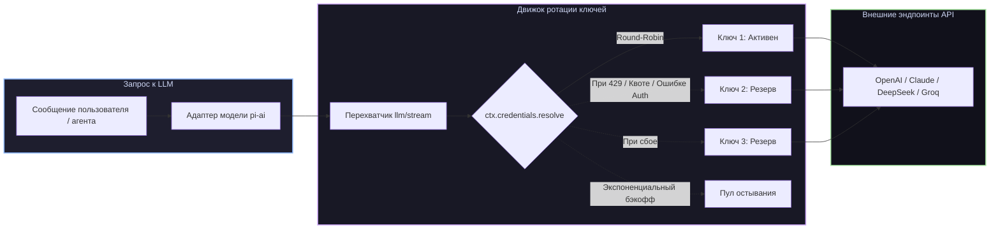

# 📦 @goodandready/dsh-key-rotation

<div align="center">

<h3>Прозрачная ротация API-ключей в стиле Hermes и мгновенное переключение при лимитах 429 для DeepSeek Harness</h3>

<p align="center">
  <a href="https://www.npmjs.com/package/@goodandready/dsh-key-rotation"></a>
  <a href="LICENSE"></a>
  <a href="https://github.com/topics/dsh-plugin"></a>
  <a href="https://nodejs.org"></a>
</p>

<p align="center">
  <a href="README.md"><b>🇬🇧 English</b></a> •
  <a href="README.ru.md"><b>🇷🇺 Русский</b></a> •
  <a href="README.zh.md"><b>🇨🇳 中文说明</b></a>
</p>

</div>

---

## ⚡ Обзор

**`dsh-key-rotation`** обеспечивает прозрачную ротацию пулов API-ключей в стиле Hermes для каждого провайдера в [DeepSeek Harness](https://github.com/deepseek-ai/deepseek-harness) (dsh).

Вместо падения сессии диалога при исчерпании квоты или ошибке rate-limit (HTTP 429), плагин перехватывает запрос и мгновенно повторяет его со **следующим работоспособным ключом** из пула до начала вывода токенов клиенту.



---

## ✨ Полный обзор возможностей

### 🔄 Архитектура прозрачной ротации
* **Неизменность провайдера**: ротация меняет только разрешаемый ключ, не трогая сам маршрут. Многошаговые вызовы инструментов агента и Replay-состояние остаются на 100% стабильными.
* **Мгновенное переключение при сбоях**: перехватывает ошибки (`QUOTA`, `RATE_LIMIT`, `SERVER`, `TIMEOUT`, `TRANSPORT`, `EMPTY_RESPONSE`, `UNKNOWN_MODEL`, `AUTH`/`INVALID`) и повторяет запрос со следующим ключом до отправки первого чанка.
* **Умный кулдаун и экспоненциальный бэкофф**: исчерпанный ключ уходит в карантин на `cooldownMs`. Повторные сбои удваивают кулдаун (базовый → ×2 → ×4 → макс ×8), предотвращая перегрузку API нерабочими ключами.
* **Обработка отозванных ключей**: невалидные ключи не прерывают диалог, а сразу переводят запрос на следующий ключ.
* **Страховка для не-стриминговых вызовов**: хук `agent/request-error` защищает синхронные вызовы (Embeddings, Batch).

---

### 🖥️ Возможности панели Web GUI (**Настройки → Ротация ключей**)

| Функция | Описание |
|---|---|
| **Добавление в 1 клик** | Нажмите *Добавить ключ*, вставьте значение, готово. Имя секрета (`<PROVIDER>_API_KEY`, `_2`, `_3`) генерируется автоматически. |
| **Живой статус ключей** | Статусы в реальном времени: `используется`, `готов`, `остывает` (с таймером) и `секрет не найден` (детект опечаток). |
| **Сортировка приоритетов** | Кнопки <kbd>↑</kbd> и <kbd>↓</kbd> для настройки очередности использования ключей. |
| **Чекбоксы кодов ошибок** | Наглядные переключатели условий срабатывания вместо сырых текстовых строк. |
| **Сброс кулдауна** | Кнопка *Сбросить кулдаун* мгновенно возвращает все ключи в строй (`POST /dsh-key-rotation/reset`). |
| **Предупреждение об исчерпании** | Предупреждающий баннер, если все ключи провайдера одновременно ушли в кулдаун. |
| **Журнал сбоев** | Раскрывающийся блок *Последние ошибки* с историей 20 последних событий (`время`, `ключ`, `причина`, `кулдаун`). |
| **Быстрый поиск** | Фильтрация списка провайдеров по имени или ID модели на лету. |
| **Массовое редактирование** | Выбор нескольких провайдеров и одновременное изменение времени кулдауна. |
| **Отмена удаления** | 5-секундная плашка *Отменить* при случайном удалении ключа или пула. |
| **Импорт из `.env`** | Загрузка файла `.env` с автоматическим извлечением пар `KEY=value`. |
| **Сортировка по нагрузке** | Кнопка <kbd>⇅</kbd> сортирует ключи по убыванию суммарного числа запросов. |
| **Время последнего вызова** | Бейдж «N минут назад» рядом с каждым активным ключом. |

---

## 🔒 Безопасность и хранение ключей

* **Никаких открытых ключей в конфиге**: конфигурация хранит только **имена** переменных (например, `OPENAI_API_KEY`).
* **Защищённое хранилище на сервере**: значения ключей живут в `$DSH_HOME/.credentials.yaml` и сервисе `Credentials`.
* **Маскировка в браузере**: веб-интерфейс получает только **последние 5 символов** ключа для визуального отличия.
* **Защита Loopback**: роуты управления (`GET /status`, `PUT|DELETE /key`, `POST /reset`) отклоняют любые запросы не из локальной сети.

---

## 📦 Установка

```bash
# Из npm:
dsh plugin --profile web add @goodandready/dsh-key-rotation

# С GitHub:
dsh plugin --profile web add github:GooDAnDReaDY/dsh-key-rotation
```

---

## ⚙️ Конфигурация (`settings.yaml`)

```yaml
dsh-key-rotation:
  switchCodes: [QUOTA, RATE_LIMIT, SERVER, TIMEOUT, TRANSPORT, EMPTY_RESPONSE, UNKNOWN_MODEL]
  cooldownMs: 60000
  providers:
    - provider: openrouter
      keys: [OPENROUTER_API_KEY, OPENROUTER_API_KEY_2, OPENROUTER_API_KEY_3]
    - provider: deepseek
      keys: [DEEPSEEK_API_KEY, DEEPSEEK_API_KEY_BACKUP]
```

---

## 📄 Лицензия

MIT © [GooDAnDReaDY](https://github.com/GooDAnDReaDY)
