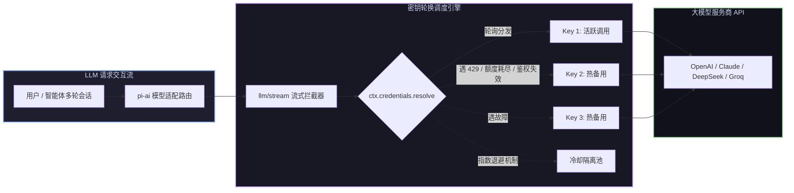

# 📦 @goodandready/dsh-key-rotation

<div align="center">

<h3>DeepSeek Harness Hermes 架构透明 API 密钥池轮换与 429 限流毫秒级容灾插件</h3>

<p align="center">
  <a href="https://www.npmjs.com/package/@goodandready/dsh-key-rotation"></a>
  <a href="LICENSE"></a>
  <a href="https://github.com/topics/dsh-plugin"></a>
  <a href="https://nodejs.org"></a>
</p>

<p align="center">
  <a href="https://goodandready.app/"></a>
</p>

<p align="center">
  <a href="README.md"><b>🇬🇧 English</b></a> •
  <a href="README.ru.md"><b>🇷🇺 Русский</b></a> •
  <a href="README.zh.md"><b>🇨🇳 中文说明</b></a>
</p>

</div>

---

## ⚡ 插件概览

**`dsh-key-rotation`** 为 [DeepSeek Harness](https://github.com/deepseek-ai/deepseek-harness) 提供 Hermes 风格的**透明多服务商 API 密钥池自动轮询与故障转移服务**。

当遇到配额耗尽或并发限流异常 (HTTP 429) 时，插件在首个 Token 传至前端前即刻静默重试，平滑切换至池中**下一个健康可用 Key**。



---

## ✨ 核心亮点全景

### 🔄 透明密钥池调度
* **服务商身份完全一致**：全程保持模型路由与会话状态不变，保障多步工具调用与 Replay 上下文 100% 稳定。
* **瞬间容灾故障切换**：拦截可切换错误码（`QUOTA`、`RATE_LIMIT`、`SERVER`、`TIMEOUT`、`AUTH`/`INVALID` 等），毫秒级顺位选用下一个可用 Key。
* **智能冷却与指数退避**：耗尽 Key 暂停调用 `cooldownMs`。连续失败时冷却期自动翻倍（基础 → ×2 → ×4 → 上限 ×8）。
* **非流式调用安全托底**：通过 `agent/request-error` 钩子全面防护 Embedding 与 Batch 等同步调用。

---

### 🖥️ Web 可视化面板功能 (**设置 → 密钥轮换**)

| 交互功能 | 详细说明 |
|---|---|
| **一键添加 Key** | 点击 *Add key* 粘贴明文，自动生成标准凭证名（`<PROVIDER>_API_KEY`、`_2` 等）。 |
| **实时健康指示灯** | 精准显示状态：`使用中`、`就绪`、`冷却倒计时` 及 `凭据不存在`（快速发现拼写手误）。 |
| **优先级自由排序** | <kbd>↑</kbd> 与 <kbd>↓</kbd> 按钮自由调整轮换顺序。 |
| **切换错误码复选** | 摒弃生硬字符串，采用复选框可视化勾选触发条件。 |
| **一键清空冷却** | 提供 *Reset cooldown* 按钮瞬间恢复所有 Key (`POST /dsh-key-rotation/reset`)。 |
| **全池耗尽告警** | 当某服务商所有 Key 均冷却时，面板呈现醒目红色警示。 |
| **错误日志追踪** | 展开 *Recent failures* 查看最近 20 次切换失败详情（时间、Key、原因、冷却时长）。 |
| **服务商即时检索** | 支持在搜索框按名称或模型 ID 毫秒级筛选卡片。 |
| **从 `.env` 批量导入** | 支持导入 `.env` 配置文件一键解析并填充密钥池。 |
| **按调用频次排序** | 点击 <kbd>⇅</kbd> 按历史累计请求量降序排列 Key。 |

---

## 🔒 密钥安全与存储规范

* **配置零明文泄露**：配置文件中仅保存凭据**变量名称**（如 `OPENAI_API_KEY`）。
* **服务端安全落盘**：密钥保存在 `$DSH_HOME/.credentials.yaml` 与 DSH `Credentials` 服务中。
* **前端 5 位字符脱敏**：前端界面仅回显**末尾 5 位字符**用于视觉辨别，绝不向浏览器回传明文。

---

## 📦 安装指南

```bash
dsh plugin --profile web add @goodandready/dsh-key-rotation
```

---

## 📄 开源协议

MIT © [GooDAnDReaDY](https://github.com/GooDAnDReaDY)
