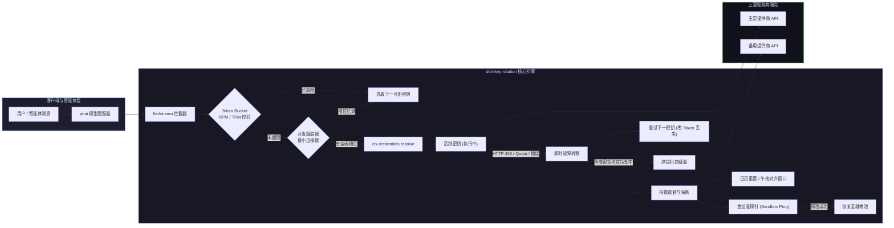

# 📦 @goodandready/dsh-key-rotation

<div align="center">

<h3>适用于 DeepSeek Harness 的企业级无感 API 密钥轮换、预判限流与跨提供商故障转移引擎</h3>

<p align="center">
  <a href="https://www.npmjs.com/package/@goodandready/dsh-key-rotation"></a>
  <a href="LICENSE"></a>
  <a href="https://github.com/topics/dsh-plugin"></a>
  <a href="https://nodejs.org"></a>
</p>

<!-- 展厅链接 -->
<p align="center">
  <a href="https://goodandready.app/"></a>
</p>

<p align="center">
  <a href="README.md"><b>🇬🇧 English</b></a> •
  <a href="README.ru.md"><b>🇷🇺 Русский</b></a> •
  <a href="README.zh.md"><b>🇨🇳 中文说明</b></a>
</p>

</div>

---

## ⚡ 概述与核心痛点

### 🛠️ v0.7.33 版本新特性 (稳定性与问题修复)
- **🔍 修复密钥探测 BaseURL 解析**：`resolveBaseUrl` 现已支持从密钥 ref 反查归属提供商池，恢复在线模型连通性探测。
- **🛡️ 防御级联无限递归**：在跨提供商故障转移中增加递归深度防护，彻底杜绝循环级联导致的堆栈溢出。
- **🕒 纠正 PST 太平洋时间配额重置**：修复 UTC-8 时区偏移符号，确保日配额在太平洋时间午夜准时重置。
- **🧹 定时器生命周期自动回收**：将金丝雀探测与自愈定时器纳入 Cordis 效应生命周期，消除热重载遗留孤儿定时器。
- **⚡ 负载均衡超时锁自动释放**：`pickLeastLoaded` 算法现已检测过期连接锁，确保最小连接调度不发生偏移。
- **🌐 完整中文界面本地化**：为 React 设置面板补充全部 `zh` 语言包，实现标准的三语（英/俄/中）无缝对齐。


### 🚀 v0.7.31 版本新特性
- **⚡ O(1) 令牌桶累加器**：将速率限制计算升级为 O(1) 时间复杂度与零内存分配，并支持响应头自适应同步。
- **🛡️ 软/硬故障分级退避**：区分临时网络抖动（502/503/超时获得 10 秒平缓冷却）与硬性配额超限（指数退避倍增）。
- **⏳ 惩罚衰减（Penalty Decay）**：持续稳定运行的密钥每小时自动平减一次失败惩罚系数。
- **🎲 冷却抖动（Jitter）**：为解锁时间添加 ±12.5% 随机离散度，彻底消除上游惊群效应。
- **🎯 定向金丝雀探测**：支持针对具体目标模型进行轻量级单 Token 连通性探测。
- **📊 TTFT 百分位数（p50 / p95 / p99）**：在高精健康度指标中计算首字延迟百分位数。
- **🔔 Webhook 警报聚合摘要**：在 5 秒窗口内将突发告警合并为单一结构化事件摘要，支持 Telegram/Discord/Slack。
- **🧹 30 天用量压缩**：自动清理超过 30 天的历史统计数据，保障长期运行内存上限。
- **✨ 乐观 UI 与快速筛选标签**：一键重置即时生效，密钥列表新增 `全部`、`就绪`、`冷却中`、`故障` 状态筛选胶囊。


在高吞吐量自主智能体运行、多子智能体并行执行与多轮工具调用场景下，API 极易触发上游服务商的速率限制（HTTP 429 Too Many Requests、RPM/TPM 耗尽、每日配额限制或网络抖动）。在原生的 DeepSeek Harness 中，单个密钥耗尽会导致整个智能体执行链路崩溃，破坏会话的 Replay 状态并要求人工干预。

**`dsh-key-rotation`** 基于 Cordis 微内核架构构建，提供了无缝透明的 **API 密钥池轮换、客户端预判限流（Token Bucket）与跨提供商故障转移（Failover Cascade）** 解决方案。

与修改模型提供商 ID 的传统网关代理不同，`dsh-key-rotation` 通过运行时拦截 `ctx.credentials.resolve` 与 `llm/stream` 钩子工作：
* **保持提供商身份一致**：仅切换底层解析的 API 密钥，维持 `pi-ai` 多轮会话与工具状态 100% 一致。
* **令牌桶预判限流**：在发起网络请求前预先跳过已饱和的密钥，彻底消除重试网络延迟。
* **最小连接数并发控制**：动态均衡各密钥的 In-Flight 并发流，防止并发突发拥塞。
* **金丝雀自愈与级联**：通过轻量 Sandbox 探测探活冷却密钥，密钥全耗尽时自动级联到备用提供商。

---

## 🏗️ 架构与请求生命周期



---

## ✨ 核心功能详解

### 🔄 1. 透明轮换与即时故障转移
* **维持提供商标识一致**：轮换仅替换底层解析的凭证引用，不改变 Provider ID，彻底避免 `INVALID_REPLAY_STATE` 异常。
* **零 Token 丢失重试**：在首个内容块发出前发生错误时，无感重试并切换至池中下一个健康密钥。
* **全状态码支持**：支持 `QUOTA`、`RATE_LIMIT`、`SERVER`、`TIMEOUT`、`TRANSPORT`、`EMPTY_RESPONSE`、`UNKNOWN_MODEL`、`AUTH` 等。
* **正则消息模式分类**：内置 `SWITCHABLE_MESSAGE_PATTERN` 正则引擎，自动识别 SDK 抛出的非结构化配额与限流异常。
* **非流式安全防护**：通过 `agent/request-error` 生命周期钩子保护 Embeddings 及 Batch 调用。

### ⏱️ 2. 预判限流与并发控制
* **Token Bucket 令牌桶 (`lib/bucket.js`)**：滑动窗口跟踪每分钟请求数 (`rpmLimit`) 与 Token 数 (`tpmLimit`)，预先拦截超限密钥。
* **最小连接负载均衡 (`lib/concurrency.js`)**：实时追踪每把密钥的活跃流数量 (`inFlight`)，执行 `maxConcurrency` 限制。
* **死锁自动释放**：针对网络异常中断连接，超时 5 分钟自动清理占用计数。

### 🛡️ 3. 自动愈合与跨提供商级联
* **跨提供商故障转移级联 (`lib/cascade.js`)**：主提供商密钥全部冷却时，自动级联路由到备用提供商池。
* **金丝雀探针探活 (`lib/canary.js`)**：密钥出冷却期前，自动发起轻量探测验证上游可用性，避免影响用户真实请求。
* **配额日历重置对齐 (`lib/quota-window.js`)**：支持 `midnight_utc`、`midnight_pst` 与 `rolling_24h` 配额刷新窗口。
* **自适应指数退避 (`lib/pool.js`)**：连续失败使冷却时间呈指数递增（基准 → ×2 → ×4 → 上限 ×8）。

### 📊 4. 统计分析与多平台交互式 Webhook
* **交互式 Webhook (`lib/webhook.js`)**：向 **Telegram**、**Discord**、**Slack** 推送带交互按钮的富文本警报，可在移动聊天中一键重置冷却或暂停提供商。
* **使用量与成本报表 (`lib/usage-report.js`)**：按日统计各密钥请求数与预估成本，支持一键导出 CSV/JSON (`GET /dsh-key-rotation/usage-report`)。
* **延迟 SLO 监控 (`lib/histogram.js`)**：记录首字延迟（TTFT）与健康度评分 (`0..100`)。
* **影子流量测试 (`lib/shadow.js`)**：支持配置百分比的流量镜像复制以评估次要提供商。

---

## 🖥️ Web GUI 控制台 (**设置 → 密钥轮换**)

| 功能 | 说明 |
|---|---|
| **顶部状态栏微件** | DSH 顶栏实时健康徽章：🟢 正常 \| 🟡 存在冷却 \| 🔴 密钥池耗尽，点击弹出快速操作面板。 |
| **一键健康矩阵** | 运行全量密钥与模型并行沙箱测试，直观展示 HTTP 状态码与 TTFT 首字延迟。 |
| **一键凭证录入** | 点击添加自动生成规范名称（`<PROVIDER>_API_KEY`, `_2`, `_3`），悬停显示尾号。 |
| **实时状态徽章** | 实时显示：`使用中`、`就绪`、`冷却中`（带倒计时）以及 `凭证未找到`。 |
| **拖拽与顺序调整** | 使用 <kbd>↑</kbd> 和 <kbd>↓</kbd> 按钮调整轮换优先级。 |
| **密钥泄漏探测器** | 实时校验输入格式（`sk-...` 等），防止误贴私钥或无关 Token。 |
| **批量 `.env` 导入** | 支持文件导入解析并自动填充至对应提供商池。 |
| **5 秒撤销栏** | 误删密钥或提供商时提供 5 秒快速撤销操作。 |

---

## 🔒 安全性与凭证存储

* **配置零明文**：插件配置仅保存环境变量引用名（如 `MY_PROVIDER_API_KEY`）。
* **宿主安全存储**：真实密钥持久化保存在 `$DSH_HOME/.credentials.yaml`。
* **前台 5 字符脱敏**：前端仅展示密钥后 5 位字符进行视觉区分。
* **环回安全隔离**：管理接口严格限制来自本地同源请求 (`isTrustedBridgeRequest`)。

---

## 📦 安装指南

```bash
# 通过 DSH 插件管理器安装 (Web Profile):
dsh plugin --profile web add @goodandready/dsh-key-rotation

# 或直接从 GitHub 安装:
dsh plugin --profile web add github:GooDAnDReaDY/dsh-key-rotation
```

> [!IMPORTANT]
> 安装后请重启 DSH Web 服务并刷新浏览器页面：
> ```bash
> systemctl --user restart dsh-web
> ```

---

## ⚙️ 配置示例 (`settings.yaml`)

```yaml
dsh-key-rotation:
  switchCodes:
    - QUOTA
    - RATE_LIMIT
    - SERVER
    - TIMEOUT
    - TRANSPORT
    - EMPTY_RESPONSE
    - UNKNOWN_MODEL
    - AUTH
  cooldownMs: 60000
  canaryProbing: true
  concurrencyLimit: 5
  quotaResetWindow:
    type: midnight_utc
    hour: 0
  cascade:
    - provider: backup-provider-id
      model: your-backup-model-id
  webhookUrl: "https://api.telegram.org/bot<TOKEN>/sendMessage?chat_id=<CHAT_ID>"
  providers:
    - provider: your-primary-provider
      rpmLimit: 60
      tpmLimit: 100000
      keys:
        - PRIMARY_API_KEY
        - PRIMARY_API_KEY_2
        - PRIMARY_API_KEY_BACKUP
    - provider: secondary-provider
      keys:
        - SECONDARY_API_KEY
        - SECONDARY_API_KEY_2
```

---

## 📄 开源许可

MIT © [GooDAnDReaDY](https://github.com/GooDAnDReaDY)

### v0.7.35
- **生命周期清理**: 将 `credentials.resolve` 猴子补丁和 `ctx.on` 事件监听器 (`llm/stream`, `agent/request-error`) 封装在 `ctx.effect` 作用域内，确保卸载时自动注销并恢复原始方法 (#238, #239)。
- **配置密钥角色**: 在 `Config` Schema 中为 `incidentGitHubToken` 和 `webhookActionToken` 增加 `.role('secret')`，避免明文泄露并在 UI 中掩码显示 (#237)。
- **设置架构与状态**: 在设置卡片中增加原生 `settingsScope` 绑定支持，保留 HTTP 桥接安全回退机制 (#235)。
- **本地化与文案**: 侧边栏备用项 `settings.section` 标签支持本地化 `t('title')` 并配置 `locale: NS`，并在 `ctx.locale` 中注册 `zh` 中文字典 (#236)。
- **死代码清理**: 移除 header-chip 迁移后残留的废弃 `mountDashboard` 函数 (#240)。
