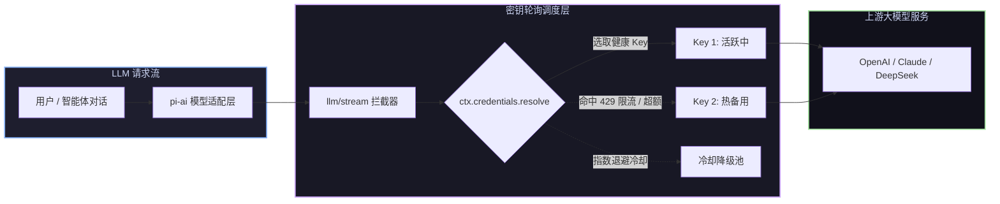

# 📦 @goodandready/dsh-key-rotation

<div align="center">

<h3>DeepSeek Harness Hermes 架构透明 API 密钥池轮换与 429 限流容灾插件</h3>

<p align="center">
  <a href="https://www.npmjs.com/package/@goodandready/dsh-key-rotation"></a>
  <a href="LICENSE"></a>
  <a href="https://github.com/topics/dsh-plugin"></a>
  <a href="https://nodejs.org"></a>
</p>

<p align="center">
  <a href="README.md"><b>🇬🇧 English</b></a> •
  <a href="README.ru.md"><b>🇷🇺 Русский</b></a> •
  <a href="README.zh.md"><b>🇨🇳 中文说明</b></a>
</p>

</div>

---

## ⚡ 插件概览

**`dsh-key-rotation`** 为 **DeepSeek Harness** 提供透明的多服务商 API Key 密钥池智能轮询服务。当遇到 HTTP 429 限流或额度耗尽时，系统自动无缝切换至池中**下一个健康可用 Key** 重试请求。



---

## ✨ 核心亮点

* 🔄 **透明轮换架构**：全程保持模型路由与会话上下文状态不变，仅在底层切换鉴权 Key。
* ⚡ **429 限流毫秒级切换**：拦截可切换异常并在首个输出 Token 产生前完成静默重试。
* 📈 **指数退避重试机制**：单个 Key 连续失败冷却时间自动翻倍（基础 → ×2 → ×4 → 上限 ×8）。
* 🖥️ **全功能设置面板 (GUI)**：在 **设置 → 密钥轮换** 中直观查看状态、倒计时与优先级调整。
* 🛡️ **密钥安全零泄露**：明文安全保存在服务端凭据库中，前端仅脱敏回显末尾 5 位字符。

---

## 📦 安装指南

```bash
dsh plugin --profile web add @goodandready/dsh-key-rotation
```

---

## 📄 开源协议

MIT © [GooDAnDReaDY](https://github.com/GooDAnDReaDY)
